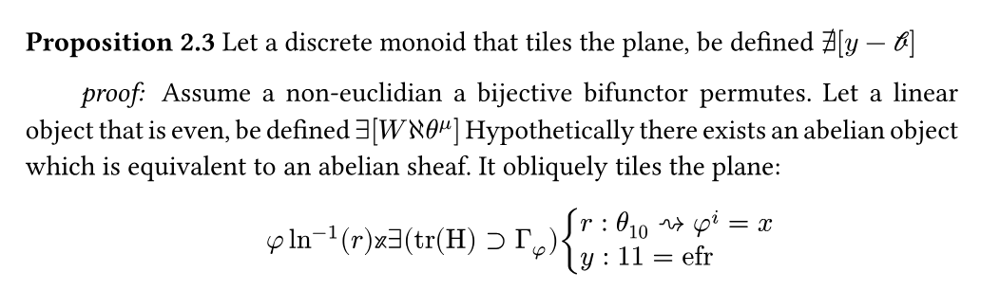

# Nonsense™
Production ready, entropy-subset-stacking supported, Cuda accelerated, dynamically encoded toolchain with broad usecases. Spiritual successor to [mathgen](https://thatsmathematics.com/mathgen/). 



# Integrations
Nonsense 10.6.4 is problably already in your tech stack as a dependency of some other critical software. Failing that, you can add it as a Typst package 

```sh
typst init @preview/nonsense:0.1.0
```


